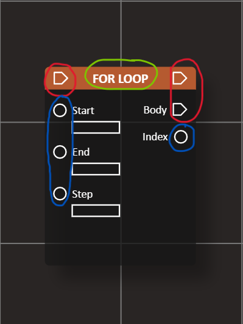
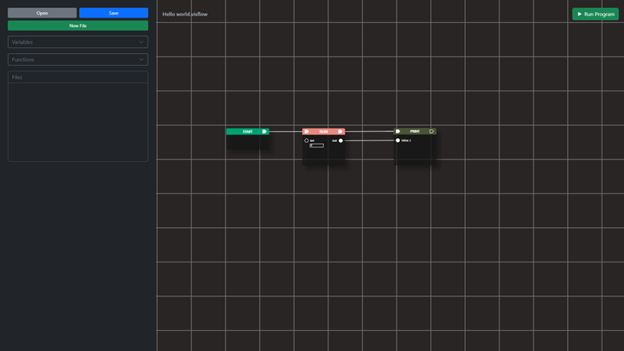
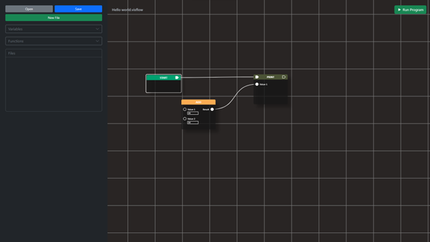

# Node Anatomy
To understand how the VPL works, we first need to know what a node is and its parts. A Node In VisFlow is basically a graphical representation of a text command in a text-based programming language.

## Parts of a node


 - Pin - encircled in red
 - Socket - encircled in blue
 - Node name - encircled in green
 - Input box - White rectangles


## Pin
A pin can be classified into two:
- Input pin
- Output pin

Nodes with pins are what we call statements. The variable node is an exception because it can be both a statment and an expression. What pin does is connect statements together to form a valid program. For Example:



The image above shows how to initialize a variable. If we look at the connection we can see that all nodes are connected together and the equivalent code would be something like this
```python
num = 0
print(num)
```
but if we remove the connection of pins between the print node and the variable node then the ```print``` statement will not be added to code.


## Socket
A Socket can also be classified into two types:
- Input Socket
- Output Socket

A node with no pins are expression node. Basically, what a socket does is recieve and transfer value to other nodes.



In this example, we are using an add node with a value of 20 and 10. In text based programming language, its equivalent is: ```20 + 10```
As we mentioned earlier, the job of sockets is to recieve and transfer values between nodes. With the example above, we can say that the add node is transfering the sum of 
``` 20 + 10``` to the print node. The equivalent code of the example above is
```python
print(20 + 10)
```

## Input box
Input box is where we place value if we don't want to use ```string, number, boolean, array``` nodes that are provided in the program