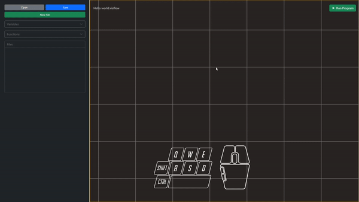

# Context Menu
The context menu contains all nodes available in our application.

To open the context menu:
1. Place the pointer to the stage. pointer should not be pointed on nodes
2. Press right click on the stage

## Avaible nodes
- **Start Node**: A compulsory node to start the program
- **Return Node**: Node that provides values that a function returns when it completes
- **Print Node**:  Node that sends text, variables, or another object to the output display
- **Println Node**: Almost the same with Print Node with its difference by providing a new line after a message is displayed
- **String Node**: Node to provide the program a sequence of characters
- **Number Node**: Manipulating different types of numbers such as simple whole integers and floating point numbers 
- **Array Node**: Providing the program with a group of related data values (called elements) that are grouped. (Separated by a comma)
- **Boolean Node**: Node that only provide two possible values: true or false
- **Add, Subtract, Multiply, Divide Nodes**: Perform arithmetic calculations using this node.
- **Comparison Node**: Conditional expressions to determine which block of node executes
- **Logical Operators (And & Or)**: Provides the program to take decisions based on certain conditions.
- **Loop Nodes (While Loop, Do While Loop, For Loop**): A node that performed instructions repeatedly as long as a specific condition remains true.
- **If Else Node**: Alternative node that is executed if the result of a previous test condition evaluates 
