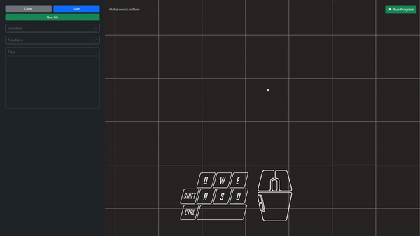

# Creating Nodes
Creating nodes in the program is one of the most important step in creating a program in our application. By this time, we expect you to already know how to open the *context menu*. if not you can go to [Opening context menu](contextmenu.md) to learn more.

To create a node:
1. Open the context menu by pressing right click on the stage
2. Find the node that you want to create.
3. Click the name of the node you want to create.

After the clicking the name of the node, the application will automatically place the node on the stage.
> Note:
> The placement of the node depends on the last position of the pointer prior to opening the context menu.

