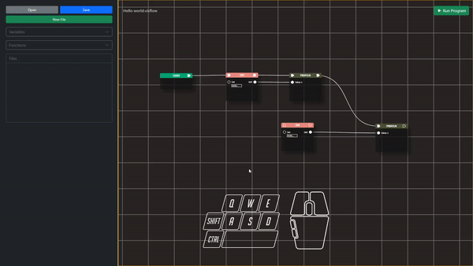

# Deleting Nodes
While creating a program in our application, it is inevitable that you will place unnecesary node on the stage. In this page, you will learn how to delete nodes on the stage.

There are two ways to delete node
- Using right click to show a modal that contains the delete node
- Using the selector delete multiple nodes.

### Deleting a node using Right Click
1.  Hover the pointer on top of the node you want to delete
2.  Right click the node while pointer is over the node
3.  Click delete node

### Deleting nodes using Selector 
1. Press Left Shift
2. Press the left mouse button while pointing on an empty space on the stage
3. Drag the mouse until the selector cover all the nodes you want to delete
4. Click delete node

> We only recommend the use of selector to delete node if you want to delete multiple nodes