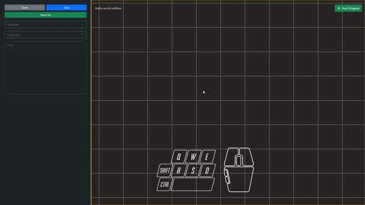
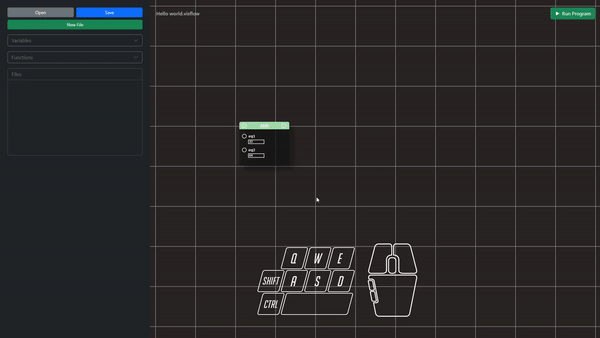
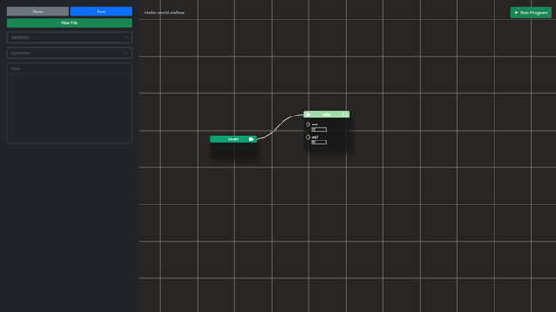

# Creating Function
A distinct feature of VisFlow to other Visual Programming Languages is to create a function that can be used repeatedly.

To create a function:
1.	From the sidebar, click the “Functions” drop-bar menu.
2.	From there, click “Create Function   +”
3.	Provide the Function parameters:
    * **Function name**: Must be unique.
    * **Return type**: Indicates the data type of the value that the function will return.
    * **Paremeter Count**: A field to state how many parameters does a function accept.

## Adding Logic to the function
Although we created a function, it still does not do anything because we did not add the logic that the function should perform.

To implement logic to a function:
1. Right click the node
2. Click edit node
3. Add nodes inside the function
4. Connect each nodes

> It is important that other nodes have connection to the body of the function in order for it to run properly

## Executing a function
To execute a function, the pins of the function node should have a connection with other nodes.

If we are using a function that has return type other than void, then we can get the output of the function and print is so we can see what the result is.
