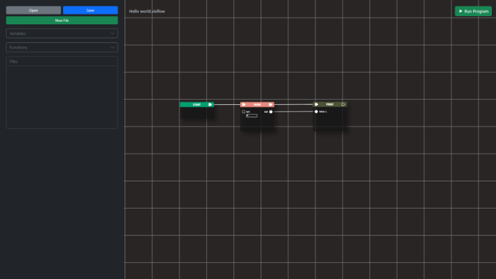

# Creating Variables
VisFlow allows variable declaration with the added capability of variable reusability.


To create a variable node:
1.	On the sidebar, left-click the “Variables” dropdown to see the Variables Menu.
2. Create a variable by pressing “Create Variable       +”
3.	Create a variable by entering parameters in the "Create Variable" pop-up menu:

    * **Variable Name**: Name of the variable to be declared
    * **Data Type**: Specify which type of value the variable need (String, Number, Boolean, Array)
    * **Initial Value**: First value of the variable
4. Press the create button to create the node

## Initializing a Variable
Although we have created a variable node, it will not be initialized unless its pins are connected with another node. For reference, below is an example of an initialized variable.


Since the node has already been initialized, we can now use the value contained in that variable.



## Reusing an already initialized variable
We can also reuse the variable that we created


As you can see in the image above, we created another instance of the variable previously. Although, we can use only one instance of the variable, It is much better know the difference between those two. As we hinted earlier, when we are connecting the pins of a variable node, it means that we are *initializing the variable*. On the other hand, when we do not connect the pins with other nodes, it means that we are only *getting the value of a variable*. To make it clear, below is the equivalent code of the image above.
```python
num = 0
print(num)
print(num)
```
## Reassigning a variable
To reassign a new value to a variable, we must connect the pins of the variable to other nodes.


The output code of the image above is:
``` python
num = 0
print(num)
num = 31
print(num)
```