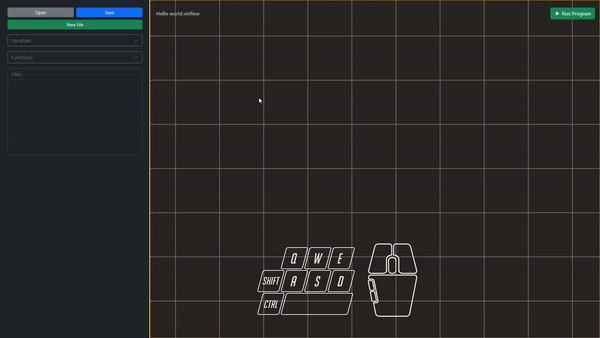
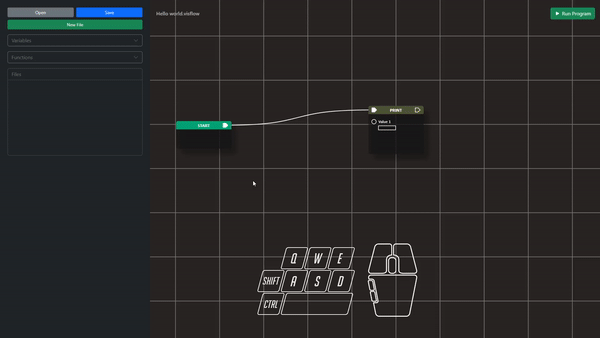

# Wiring
Creating ang placing nodes on the stage is not enough to create a program. Connections between nodes should be made in order to make a valid program. Before going through this portion of the documentation, please ensure that you have an idea about the [anatomy of a node]().

## Correct way of connecting nodes

The idea behind the proper connection of nodes is that you should only connect shapes that are the same. Below are the wiring constraints that are implemented in our program:
- Connection between two inputs are not allowed
- Connection between two outputs are not allowed
- Connection between sockets and pins are note allowed
- A pin can only have one connection
- An input socket can only accept one connection
- An output socket can have multiple connections/outgoing wire

In the future, socket connection that contains different data type will not be allowed

## Wrong way of connecting nodes
